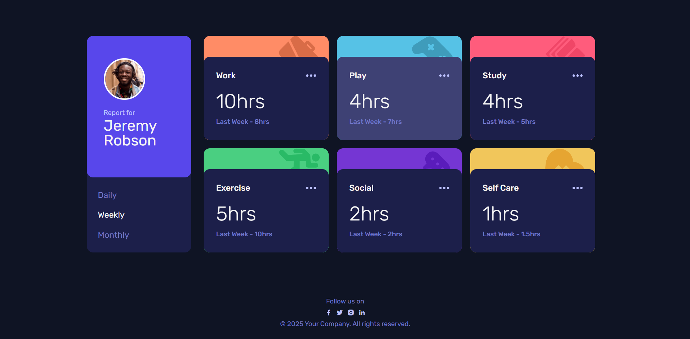

# Frontend Mentor - Time Tracking Dashboard Solution

This is a solution to the [Time Tracking Dashboard challenge on Frontend Mentor](https://www.frontendmentor.io/challenges/time-tracking-dashboard-UIQ7167Jw). Frontend Mentor challenges help you improve your coding skills by building realistic projects.

## Table of Contents

- [Overview](#overview)
  - [The Challenge](#the-challenge)
  - [Screenshot](#screenshot)
  - [Links](#links)
- [My Process](#my-process)
  - [Built With](#built-with)
  - [What I Learned](#what-i-learned)
  - [Continued Development](#continued-development)
  - [Useful Resources](#useful-resources)
- [Author](#author)
- [Acknowledgments](#acknowledgments)

## Overview

### The Challenge

Users should be able to:

- View the optimal layout for the site depending on their device's screen size
- See hover states for all interactive elements on the page
- Switch between viewing Daily, Weekly, and Monthly stats

### Screenshot

### Links

- Solution URL: [Solution URL here](https://github.com/abhi-zero/time-tracking-dashboard)
- Live Site URL: [Live site URL here]( https://abhi-zero.github.io/time-tracking-dashboard/)

## My Process

### Built With

- Semantic HTML5 markup
- CSS custom properties
- Flexbox
- CSS Grid
- Mobile-first workflow
- Vanilla JavaScript

### What I Learned

During this project, I learned how to:

- Use CSS Grid and Flexbox to create responsive layouts.
- Fetch and display data dynamically using JavaScript.
- Implement a mobile-first workflow to ensure the site looks great on all devices.

### Continued Development

In future projects, I want to continue focusing on:

- Improving my JavaScript skills, particularly with asynchronous operations.
- Enhancing my understanding of CSS Grid and Flexbox for more complex layouts.
- Exploring more advanced CSS techniques and animations.

### Useful Resources
- [MDN Web Docs](https://developer.mozilla.org/) - A great resource for web development documentation and tutorials.
- [CSS-Tricks](https://css-tricks.com/)  Helpful articles and guides on CSS.

### Author

- Frontend Mentor - [@abhi-zero](https://www.frontendmentor.io/profile/abhi-zero)

### Acknowledgments

Thanks to Frontend Mentor for providing this challenge and helping me improve my skills. Special thanks to the community for their support and feedback.